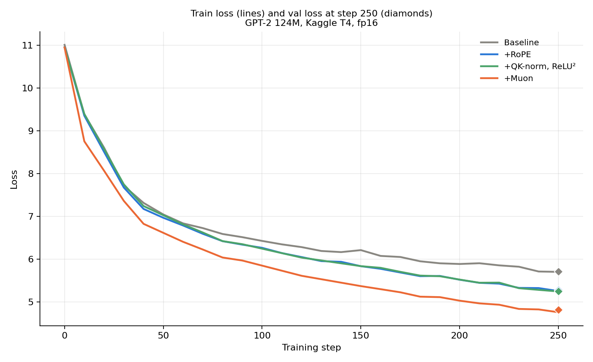

# gpt2-speedrun

Reproducing GPT-2 (124M) from the nanoGPT / llm.c / modded-nanogpt lineage,
on Kaggle T4 instead of 8xH100 — so no FlexAttention, no fp8, no bf16
(Turing doesn't support them). Each modernization (RoPE, QK-norm, ReLU²,
Muon optimizer) implemented by hand, one at a time, with a measured
before/after — not a black-box import of the final speedrun script.

This is a reproduction/engineering project, not original research: the
goal was to actually understand each piece of the modern GPT training
recipe by implementing and measuring it.

## Experimental setup

- Model: GPT-2, 124M params (12 layers, 12 heads, 768 dim, 1024 context)
- Data: FineWeb-Edu sample, tokenized with tiktoken's GPT-2 BPE, 50M tokens
- Effective batch size: ~131K tokens/step (batch 8 × grad accum 16 × 1024 context)
- Optimizer: AdamW (lr 6e-4, weight decay 0.1) for embeddings/norms/biases; Muon (lr 0.02) for attention/MLP matrices where applicable
- Precision: fp16 with GradScaler
- Steps per run: 250 (fixed across all four configurations for direct comparison)
- Seed: 1337
- GPU: Kaggle T4
- PyTorch: `2.10.0+cu128`

## Results

All runs: same seed, same data slice, same 250-step checkpoint (setup
above), fp16 + GradScaler. Full details and caveats for each entry in
[`BUILDLOG.md`](./BUILDLOG.md) — including where a result is likely still
within run-to-run noise at this step count.

| Stage | Val loss | Δ vs. baseline | s/step | Δ vs. baseline |
|---|---|---|---|---|
| Baseline (vanilla GPT-2) | 5.7123 | — | ~10.3 | — |
| + RoPE | 5.2801 | -7.6% | ~11.1 | +7.8% |
| + QK-norm, ReLU² | 5.2474 | -8.1% | ~12.5 | +21.4% |
| + Muon optimizer | **4.8146** | **-15.7%** | ~13.6 | +32.0% |



RoPE and Muon were the two largest single changes; QK-norm/ReLU² gave a
smaller, more uncertain improvement at this step count. Muon buys the
most loss reduction but also carries the largest compute overhead by this
point — RoPE has the best loss-improvement-per-compute-cost ratio of the
three additions.

## Setup (Kaggle)

Use **T4**, not P100 — Kaggle's current PyTorch build requires CUDA
capability sm_70+, and P100 (Pascal, sm_60) isn't supported. Found this out
the hard way on Day 1, worth flagging so nobody else wastes a session on it.

1. New notebook → Notebook options → Accelerator: **GPU T4 x2**. Internet: On.
2. First cell:

```bash
!git clone https://github.com/modestesavadogo/gpt2-speedrun.git
%cd gpt2-speedrun
!pip install -r requirements.txt --quiet
```

## Usage

```bash
# 1. tokenize a data slice (defaults to 50M tokens, FineWeb-Edu sample)
python prepare_data.py --num_tokens 50_000_000 --out_dir data

# 2. train (fp16 on T4, checkpoints to checkpoints/ckpt.pt)
python train.py --config configs.kaggle_p100 --data_dir data --out_dir checkpoints

# 3. if a Kaggle session gets cut off mid-run, resume:
python train.py --config configs.kaggle_p100 --data_dir data --out_dir checkpoints --resume
```

Each run appends a summary block to `BUILDLOG.md` automatically.

## Repo layout

```
model.py            GPT-2 architecture: RoPE, QK-norm, ReLU² (nanoGPT-derived base)
muon.py              Muon optimizer (Newton-Schulz orthogonalized updates)
prepare_data.py      tokenizes FineWeb-Edu -> train.bin / val.bin
train.py             training loop, fp16/GradScaler, dual optimizer (Muon + AdamW), resumable
configs/
  kaggle_p100.py     hyperparams sized for 16GB VRAM (name kept for history; runs on T4)
BUILDLOG.md           trace of advancement, one entry per technique, with numbers
```

## References

Code lineage:
- [nanoGPT](https://github.com/karpathy/nanoGPT) — Karpathy
- [llm.c](https://github.com/karpathy/llm.c) — Karpathy
- [modded-nanogpt](https://github.com/KellerJordan/modded-nanogpt) — Keller Jordan et al., the speedrun this follows

Papers and writeups read while building this (not just cited in code):
- Vaswani et al., [Attention Is All You Need](https://arxiv.org/abs/1706.03762) — origin of sinusoidal positional encoding, ancestor of RoPE's frequency scheme
- Radford et al., [GPT-2](https://cdn.openai.com/better-language-models/language_models_are_unsupervised_multitask_learners.pdf) — the model being reproduced
- Kazemnejad, [Transformer Architecture: The Positional Encoding](https://kazemnejad.com/blog/transformer_architecture_positional_encoding/)
- Su et al., [RoFormer](https://arxiv.org/abs/2104.09864) (RoPE)
- EleutherAI, [Rotary Embeddings: A Relative Revolution](https://blog.eleuther.ai/rotary-embeddings/)
- Henry et al., [Query-Key Normalization for Transformers](https://arxiv.org/abs/2010.04245)
- Dehghani et al., [Scaling Vision Transformers to 22 Billion Parameters](https://arxiv.org/abs/2302.14103) (QK-norm needed at scale)
- So et al., [Primer](https://arxiv.org/abs/2109.08668) (squared ReLU)
- Touvron et al., [LLaMA](https://arxiv.org/abs/2302.13971) — RoPE, RMSNorm, SwiGLU used together in a production model

## License

MIT — see [LICENSE](./LICENSE).
